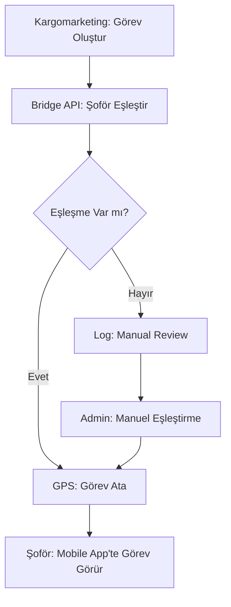

# 🔗 Şoför Eşleştirme Sistemi

## 📋 Kargomarketing ↔ GPS Backend Bağlantısı

### 🎯 Problem

Kargomarketing'den gelen görev verileri:

- ✅ `ilan_no` (unique identifier)
- ✅ `şoför_adi` (string, büyük/küçük harf karışık)
- ✅ `iş_emri` numarası
- ✅ Müşteri bilgileri

GPS Backend'inde bu verileri `auth.users` ve `profiles` ile eşleştirmek gerekiyor.

## 🔧 Çözüm: Multi-Layer Matching System

### **1. Database Schema Güncellemeleri**

#### Profiles Tablosu Eklenen Alanlar

```sql
kargomarketing_sofor_id VARCHAR(100)  -- Kargomarketing'deki şoför ID
tc_kimlik VARCHAR(11) UNIQUE          -- TC ile eşleştirme
email VARCHAR(255) UNIQUE             -- Email ile eşleştirme
```

#### Görevler Tablosu Eklenen Alanlar

```sql
kargomarketing_gorev_id VARCHAR(100)  -- Orijinal görev ID
iş_emri VARCHAR(100)                  -- İş emri numarası
```

### **2. Eşleştirme Stratejileri**

#### **Strateji A: İsim Bazlı Eşleştirme**

```sql
-- Tam ad eşleştirmesi
LOWER(CONCAT(ad, ' ', soyad)) = LOWER(kargomarketing_sofor_adi)

-- Kısmi eşleştirme (fallback)
LOWER(ad) LIKE '%' || LOWER(SPLIT_PART(kargomarketing_sofor_adi, ' ', 1)) || '%'
```

#### **Strateji B: Unique ID Eşleştirmesi**

```sql
-- TC Kimlik ile eşleştirme (en güvenilir)
profiles.tc_kimlik = kargomarketing_driver.tc_no

-- Email ile eşleştirme
profiles.email = kargomarketing_driver.email
```

#### **Strateji C: Manual Mapping**

```sql
-- Kargomarketing ID ile direct mapping
profiles.kargomarketing_sofor_id = kargomarketing_driver.id
```

### **3. Bridge API Integration**

#### Kargomarketing'den Görev Geldiğinde

```typescript
// 1. Şoför eşleştirme fonksiyonu çağır
const matched_driver = await supabase
  .rpc('match_driver_by_name', {
    kargomarketing_sofor_adi: task.driver_name,
    ilan_no_param: task.ilan_no
  });

// 2. Eğer eşleşme varsa görev ata
if (matched_driver) {
  await supabase
    .from('gorevler')
    .insert({
      ilan_no: task.ilan_no,
      sofor_id: matched_driver,
      sofor_adi: task.driver_name,
      kargomarketing_gorev_id: task.id,
      iş_emri: task.work_order,
      // ... diğer veriler
    });
}
```

### **4. Fallback Mechanisms**

#### **Eşleşme Bulunamazsa:**

1. ✅ `driver_match_logs` tablosuna kaydet
2. ✅ Admin dashboard'da manuel eşleştirme seçeneği
3. ✅ Notification sistemi ile alert gönder

#### **Multiple Match Durumu:**

1. ✅ En son kayıtlı profiles'ı seç
2. ✅ created_at bazlı önceliklendirme
3. ✅ Manual review için flag

### **5. Data Sync Workflow**



### **6. Implementation Priority**

#### **Phase 1: Basic Name Matching** ✅

- İsim bazlı eşleştirme aktif
- Fallback logging sistemi
- Bridge API integration

#### **Phase 2: Enhanced Matching**

- TC Kimlik entegrasyonu
- Email based matching
- Admin dashboard

#### **Phase 3: AI-Powered Matching**

- Fuzzy string matching
- Machine learning models
- Auto-correction

## 🎯 Sonuç

**Şoför eşleştirme sistemi şu özelliklere sahip:**

✅ **Multi-layer matching:** İsim → TC → Email → Manual  
✅ **Fallback logging:** Eşleşmeyen durumlar kaydediliyor  
✅ **Performance optimized:** İndeksler ve efficient queries  
✅ **Bridge API ready:** Kargomarketing entegrasyonu hazır  
✅ **Admin friendly:** Manuel eşleştirme seçenekleri  

**Bu sistem ile Kargomarketing'den gelen tüm görevler GPS backend'inde doğru şoförlere atanabilir!** 🚀
