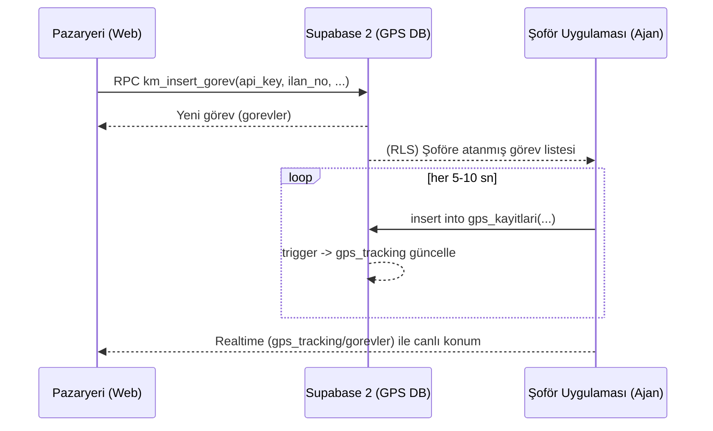

# GPS Agent Entegrasyon Rehberi

Bu rehber, GPS ajanı (şoför uygulaması/servisi) açısından Supabase 2 (GPS DB) üzerinde çalışacak akışı, tablo şemalarını, RLS kurallarını ve RPC uçlarını özetler.

## 1) Genel Mimari

- İki Supabase projesi vardır:
  - Supabase 1: Ana platform (pazaryeri).
  - Supabase 2: GPS veritabanı (şoför uygulaması/ajanı). Bu rehber Supabase 2 içindir.
- İş emirleri (gorevler) Supabase 2’de tutulur. Pazaryeri, gorevler’e yalnızca RPC üzerinden kayıt açar (RLS uyumlu).
- Şoför uygulaması, kendine atanan görevlere GPS verisi (gps_kayitlari) yazar.
- Son konum özetleri (gps_tracking) ve/veya gorevler.son_konum_lat/lng üzerinden okunur. Realtime ile canlı akış mümkündür.

## 2) Tablolar ve Akış

- public.gorevler
  - Zorunlu alanlar: ilan_no (varchar 50), tc_kimlik (varchar 11), sofor_adi (varchar 100), teslimat_adresi (text)
  - Opsiyonel: musteri_bilgisi, ilan_aciklama, baslangic_adresi
  - Trigger’lar: auto_assign_driver (INSERT/UPDATE), notify_task_status_change (UPDATE), update_modified_column (UPDATE)
  - RLS (özet):
    - app.user_role = 'kargomarketing_api' olan istekler API olarak tam erişim alır (INSERT/SELECT/UPDATE sınırlı kurallarla).
    - Şoför (auth.uid() = sofor_id) kendi görevini görebilir/güncelleyebilir.
- public.gps_kayitlari
  - Kolonlar: sofor_id (uuid, NOT NULL), latitude (numeric, NOT NULL), longitude (numeric, NOT NULL), hiz/yon/dogruluk (opsiyonel), gorev_id (uuid)
  - Trigger: on_gps_update → update_gps_tracking()
  - RLS (özet): Yalnızca şoför (auth.uid()) kendi kayıtlarını yazabilir/görebilir. Ayrıca gorev_id’nin o şoföre ait görevle eşleşmesi beklenir.
- public.gps_tracking
  - Son konum kayıtları/özet. Realtime dinleme için uygun.

Akış özeti:

1) Pazaryeri, gorevler’e yeni iş emri açar (RPC ile).
2) Trigger şoförü otomatik atar (tc_kimlik + ilan_no eşleştirme mantığı).
3) Şoför görevi kabul eder/başlatır.
4) Ajan (şoför uygulaması) 5 sn’de bir gps_kayitlari’na satır ekler → trigger gps_tracking’i günceller.

## 3) RPC Uçları (RLS Güvenli)

Gizli anahtar, public.app_config tablosunda tutulur (key='km_api_key').

- km_insert_gorev(api_key text, p_ilan_no varchar, p_tc_kimlik varchar, p_sofor_adi varchar, p_teslimat_adresi text, p_musteri_bilgisi text, p_baslangic_adresi text, p_ilan_aciklama text)
  - Amaç: gorevler’e RLS uyumlu INSERT.
  - Davranış: api_key doğrulanır → app.user_role='kargomarketing_api' set edilir → INSERT yapılır → satır döner.
- km_list_gorevler(api_key text) returns setof public.gorevler
  - Amaç: RLS uyumlu SELECT (listeleme).

Not: RPC’ler Supabase 2’de tanımlıdır. Gizli anahtar şu tabloda saklanır:

- public.app_config (key, value)
  - km_api_key değeri: "NERELİYİMSALUR" (örnek/konfigürasyon; üretimde değiştirin).

## 4) RLS Kuralları (Özet)

- gorevler
  - API erişimi: current_setting('app.user_role', true) = 'kargomarketing_api'
  - Şoför erişimi: auth.uid() = sofor_id
- gps_kayitlari
  - INSERT/SELECT/DELETE: auth.uid() = sofor_id ve gorev_id ilişkisi doğrulanır.

Sonuç: Pazaryeri API’si, RPC ile app.user_role bayrağını açar; şoför uygulaması normal kullanıcı oturumu ile (anon key + email/sms otp vb. ile giriş) kendi kayıtlarını yönetir.

## 5) Realtime (Canlı Akış)

- gorevler tablosu: Değişiklikleri dinleyip görev listesi tazelenebilir.
- gps_tracking tablosu: gorev_id bazında INSERT/UPDATE olaylarını dinleyerek canlı konum güncellenebilir.
- Alternatif: gorevler.son_konum_lat/lng alanı UPDATE olayları dinlenebilir.

Örnek kanal (Supabase JS):

```ts
supabase
  .channel('gps-tracking-' + gorevId)
  .on('postgres_changes', { event: '*', schema: 'public', table: 'gps_tracking', filter: `gorev_id=eq.${gorevId}` }, payload => {
    // UI'ı güncelle
  })
  .subscribe();
```

## 6) Ajan (Şoför Uygulaması) Tarafı

- Kimlik doğrulama: Supabase 2 anon key ile giriş/oturum (magic link/sms/şifre). auth.uid() şoför kimliğini temsil eder.
- Görevleri görme: gorevler tablosunda sofor_id = auth.uid() olan görevler görünür (RLS).
- GPS yazma: gps_kayitlari’na her ping’de satır eklenir; sofor_id = auth.uid() olmalı ve gorev_id doğru atanmalı.
- Örnek ekleme:

```sql
insert into public.gps_kayitlari (gorev_id, sofor_id, latitude, longitude, hiz, yon, dogruluk)
values ('<gorev_uuid>', '<auth_uid>', 41.0, 29.0, 50, 180, 5);
```

- Performans/TTL: Ham kayıtlar yoğun ise TTL/özetleme/partisyon önerilir (opsiyonel).

## 7) Pazaryeri (KargoMarketing) Tarafı

- Frontend çevresi: VITE_GPS_SUPABASE_URL, VITE_GPS_SUPABASE_ANON_KEY, VITE_KM_GPS_API_KEY (app_config ile aynı değer)
- İş emri oluşturma: `km_insert_gorev` RPC çağrısı – zorunlu 4 alan: ilan_no, tc_kimlik, sofor_adi, teslimat_adresi.
- Listeleme: `km_list_gorevler` RPC.

## 8) Test Adımları

1) app_config → km_api_key ayarlı mı? (`SELECT value FROM public.app_config WHERE key='km_api_key';`)
2) RPC’ler çalışıyor mu? (`SELECT * FROM public.km_list_gorevler('NERELİYİMSALUR') LIMIT 1;`)
3) İş emri oluşturma başarılı mı? (`km_insert_gorev(...)`)
4) Şoför giriş yaptıktan sonra görevi görebiliyor mu? (RLS)
5) gps_kayitlari’na ekleme sonrası gps_tracking güncelleniyor mu? (trigger)

## 9) Güvenlik Notları

- Service role key’i frontend’de asla saklamayın.
- km_api_key tek başına yetki değildir; yalnızca RPC içi doğrulamada kullanılır.
- Üretimde km_api_key’i değiştirin, admin_logs ile izleme ve hız sınırlama (rate limit) eklemeyi değerlendirin.

## 10) SSS

- JSONB yoksa canlı akış nasıl? → gps_kayitlari satırları ve/veya gps_tracking özetleri üzerinden; JSONB şart değil.
- Sürekli satır şişer mi? → Evet, 5 sn’de bir satır. TTL/partisyonlama/özetleme ile yönetilebilir.
- Şoför nasıl yetki alır? → Normal Supabase auth ile giriş; RLS sofor_id = auth.uid() olan kayıtları açar.

## 11) Ajan Hızlı Başlangıç

1) Supabase 2 projesinin anon key ve URL’ini ajana verin (sadece GPS projesi):
   - url: VITE_GPS_SUPABASE_URL
   - anon: VITE_GPS_SUPABASE_ANON_KEY
2) Şoför oturumu açsın (email/sms/magic link/şifre) → auth.uid() = şoför kimliği.
3) Ajan, atanmış görev listesini çeksin: `select * from public.gorevler where sofor_id = auth.uid()` (RLS izin verir).
4) Takip için her 5 sn’de bir `public.gps_kayitlari`’na satır ekleyin (gorev_id + sofor_id zorunlu):

```sql
insert into public.gps_kayitlari (gorev_id, sofor_id, latitude, longitude, hiz, yon, dogruluk)
values ('<gorev_uuid>', '<auth_uid>', 41.0, 29.0, 50, 180, 5);
```

5) İsteğe bağlı: `public.gps_tracking` tablosunu gorev_id filtresiyle Realtime dinleyin.

## 12) Sorun Giderme (Ajan)

- RLS hatası (gps_kayitlari insert):
  - auth.uid() boşsa → oturum yok; anon key ile giriş yapın.
  - sofor_id yanlışsa → kendi auth.uid() değerinizi yazın.
  - gorev_id size ait değilse → atanmış görevi kullanın veya görevin size atanmasını bekleyin.

- Görev listesi boş geliyor:
  - RLS gereği sadece size atanmış görevler görünür. Pazaryeri tarafından şoför ataması/trigger beklenir.

- Realtime güncellenmiyor:
  - Doğru tablo/filtre ile abone olduğunuzu kontrol edin (gps_tracking + gorev_id=eq.{gorev_id}).
  - Abonelikten önce oturum açıldığından emin olun.

- Performans/battery:
  - Ping aralığını 5–10 sn tutun; ağ kesilince kuyruklayıp tekrar deneyin.

## 13) İletişim Noktaları

- Pazaryeri (KargoMarketing) ekibi: RPC ve görev açma süreçleri
- GPS ajan ekibi: Şoför oturumu, gps_kayitlari yazımı, Realtime dinleme

## 14) Mini Diyagram (Mermaid)



## 15) Postman Koleksiyonu

- Yol: `postman/GPS_Agent_Collection.json`
- Değişkenler:
  - baseUrl: GPS Supabase URL
  - anonKey: GPS Supabase anon key
  - apiKey: RPC gizli anahtar (app_config.km_api_key)
  - driverJwt: Şoför oturumu JWT (auth oturumu sonrası)

Koleksiyonda 3 istek var:

1) km_list_gorevler (RPC): API anahtarını doğrulayarak görevleri listeler.
2) km_insert_gorev (RPC): Zorunlu 4 alanla yeni görev açar.
3) driver_insert_gps_kayit (Table): Şoför JWT ile gps_kayitlari’na satır ekler (RLS gereği şoför kendini yazar).

Notlar:

- RPC çağrılarında Authorization: Bearer {{anonKey}} yeterlidir.
- gps_kayitlari INSERT için Authorization: Bearer {{driverJwt}} gerekir (şoför login JWT).
