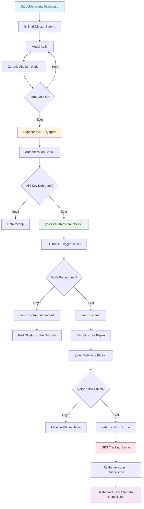
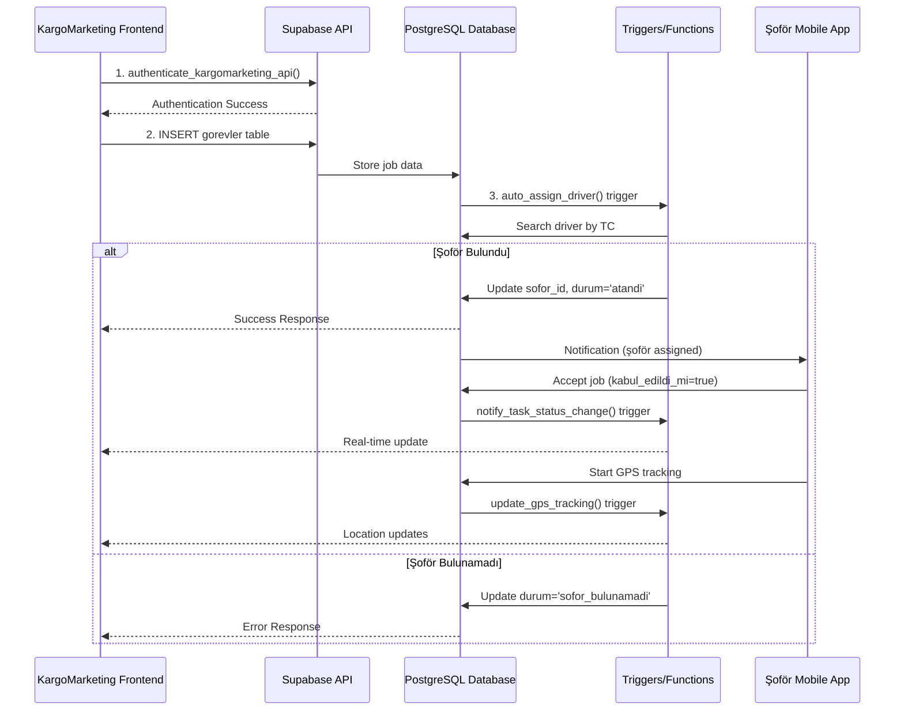
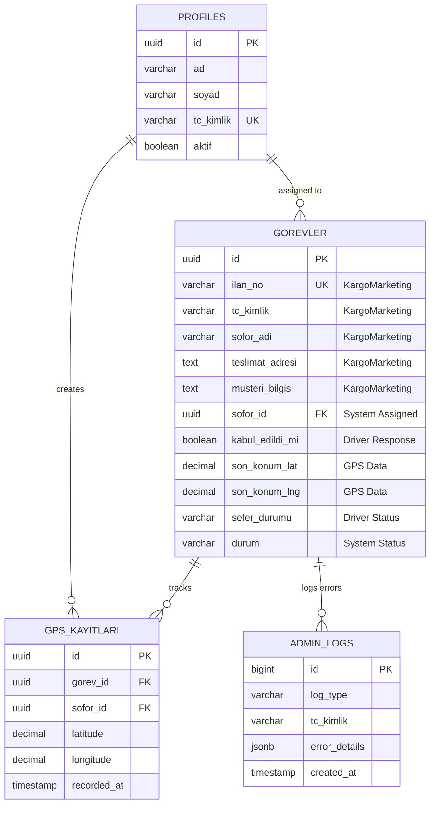
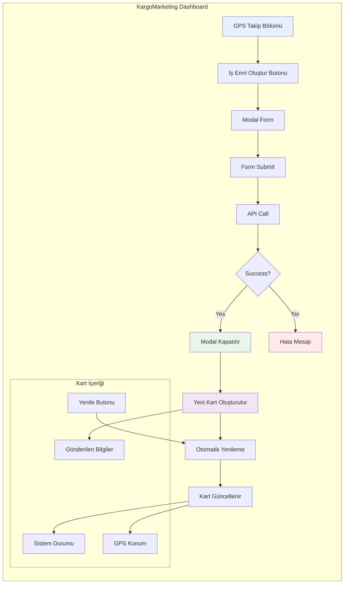
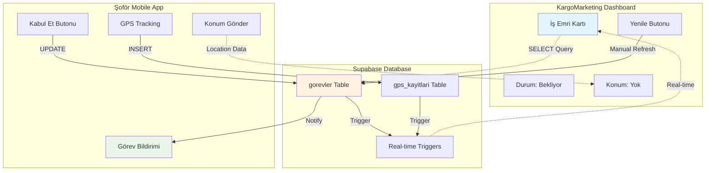

# KargoMarketing GPS Takip - Görsel Akış Diyagramı

## 🎯 SİSTEM AKIŞ ŞEMASI

## 📊 VERİ AKIŞ DİYAGRAMI

## 🏗️ TABLO İLİŞKİ DİYAGRAMI

## 🔄 KargoMarketing DASHBOARD AKIŞ

## 📱 MOBİL APP vs DASHBOARD SYNC

Bu görsel diyagramlar KargoMarketing ekibinin sistem akışını daha iyi anlamasını sağlayacak! 🎯
